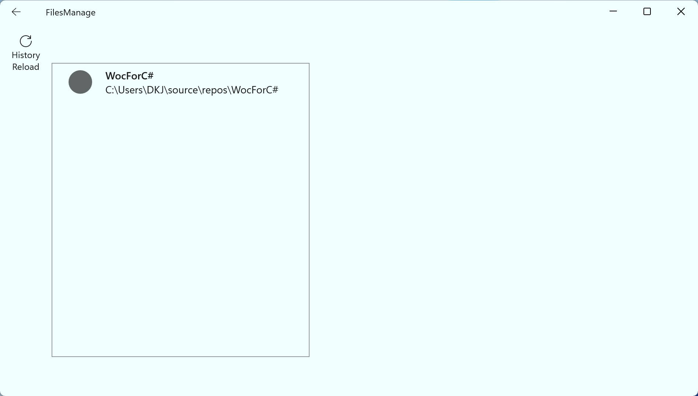
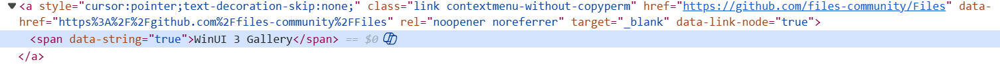

# WocForC#
---

默认窗口：

---

历史界面：

---

# Quick Start：
New Manage => 打开Windows文件选择器 => 等待加载完成后显示文件列表（加载过程中按钮呈虚） => 双击文件 => 打开文件

Refresh => 等待刷新文件列表（刷新过程中按钮呈虚） => 双击文件 => 打开文件

History => 打开历史界面 => HistoryRefreshButton_Click => 等待刷新历史文件列表（刷新过程中按钮呈虚）（顺序即选择顺序~~未实现点击对应历史直接加载~~）

Delete Picked => 打开Windows文件选择器 => Refresh => 等待刷新文件列表（刷新过程中按钮呈虚）

---

# 参考文献
[WinUI 3 Gallery](https://github.com/microsoft/WinUI-Gallery)
~~（吐槽一下：woc文档里面的这个网址错了）~~
[WinUI 3 Documentation](https://learn.microsoft.com/en-us/windows/apps/winui/winui3/)